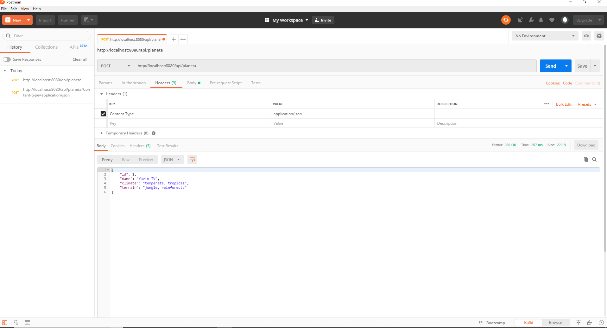

<h1>Desafio Star Wars</h1>

A aplicacao é uma API REST para cadastro de Planetas.</h4> 

<h2>Consultas</h2>

| Metodo        | Url                    | Descricao                |
| ------------- |:-------------:         | -----:                   |
| DELETE        | /api/planeta           | Deletar Planeta          |
| POST          | /api/planeta           | Inserir Planeta          |
| PUT           | /api/planeta           | Atualizar Planeta        |
| GET           | /api/planeta/{id}      | Buscar Planeta  por ID   |
| GET           | /api/planeta/{name}    | Buscar Planeta  por Nome |
| GET           | /api/planetas/         | Buscar todos Planetas    |

| Headers       |                        |                          |
| ------------- |     :-------------:    |           -----:         |
|               | Key                    | Value                    |
|               | Content-Type           | application/json         |

<h3>Exemplo:</h3>

  

Utilizado:</h2>

- Java 8 
- Spring Boot  
- PostgreSQL 9.6 
